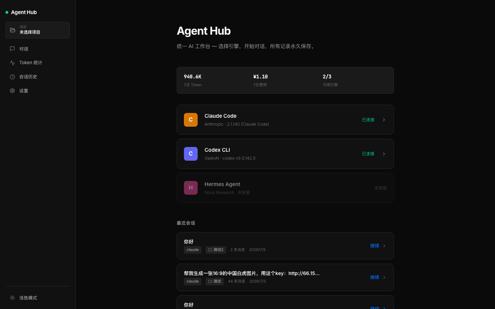
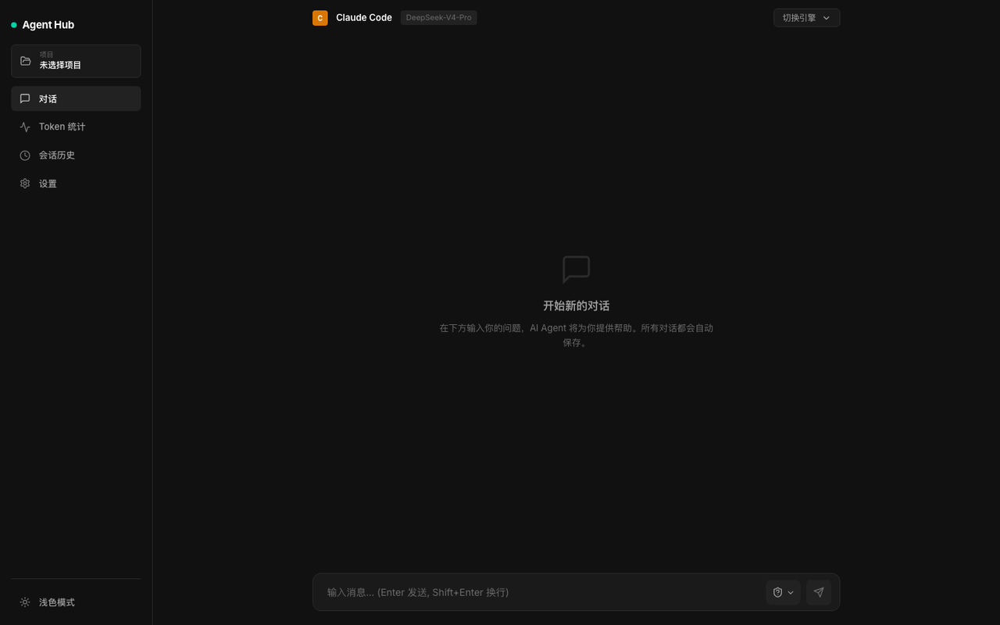
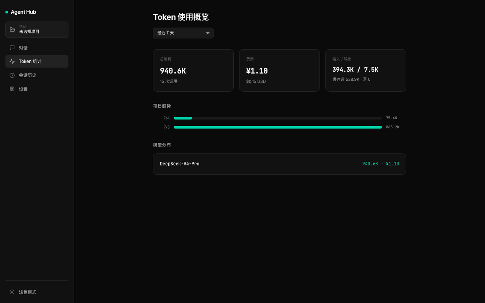
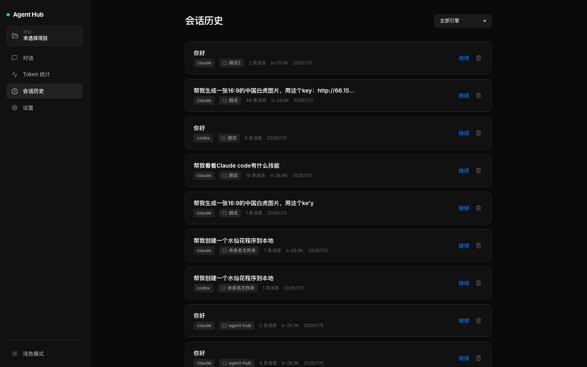

# 🚀 Super Agent Hub

  

  <strong>一个桌面应用，驾驭所有 AI 引擎</strong>

  
  
  

---

## 🤔 每天在多个 AI 工具之间反复横跳？

Claude 写代码强、Codex 懂项目上下文、Hermes 擅长长文本……每个都好用，但**来回切换太累了**。

**Super Agent Hub** 把它们全部装进一个原生桌面应用。一个界面、一套快捷键、统一体验。

---

## ✨ 为什么选它？

<table>
<tr>
  <td width="50%">
    <h3>🔌 多引擎无缝切换</h3>
    
Claude · Codex · Hermes 三大引擎自由切换，一个会话里对比不同模型的回答。新引擎持续接入中。

  </td>
  <td width="50%">
    <h3>📊 Token 消费一目了然</h3>
    
实时统计每个引擎的 Token 用量。不用再猜这个月花了多少钱，每一笔都清清楚楚。

  </td>
</tr>
<tr>
  <td width="50%">
    <h3>💾 对话永久保存</h3>
    
所有聊天记录本地加密存储，重装系统也不丢。支持搜索、导出，你的知识资产你来掌控。

  </td>
  <td width="50%">
    <h3>🪶 轻到不可思议</h3>
    
Tauri 构建的原生应用，安装包仅 <strong>20MB</strong>。内存占用不到 VS Code 的 1/3，常驻菜单栏也不卡。

  </td>
</tr>
<tr>
  <td width="50%">
    <h3>🔒 隐私优先</h3>
    
数据 100% 本地存储，不经过任何中间服务器。你的代码、对话、API Key 都只留在你的电脑上。

  </td>
  <td width="50%">
    <h3>🎨 开箱即用</h3>
    
下载 → 拖入 Applications → 开始对话。不需要配环境、不需要命令行，双击搞定。

  </td>
</tr>
</table>

---

## 📸 界面预览

  <strong>🏠 引擎选择</strong> 
  

  <strong>💬 对话界面</strong> 
  

  <strong>📊 Token 统计</strong> 
  

  <strong>💾 会话管理</strong> 
  

---

## 📦 安装

### macOS (Apple Silicon)

前往 [Releases](https://github.com/waytouniverse/super-agent-hub/releases/latest) 下载最新版 `.dmg` 文件。

双击打开 → 拖入 `Applications` 文件夹 → 完成。

> 💡 首次运行时，macOS 可能会提示「无法验证开发者」。请前往 **系统设置 → 隐私与安全性 → 仍要打开**。

### 其他平台

Windows 和 Linux 版本正在开发中，欢迎 Watch 本仓库获取更新通知。

---

## 🎯 谁在用？

- **独立开发者** — 让 Claude 写代码、让 Codex 读项目、让 Hermes 做方案，一个 App 搞定全流程
- **技术写作者** — 多模型对比翻译/润色效果，挑最满意的直接用
- **AI 重度用户** — Token 统计让你告别「不知道花了多少钱」的焦虑
- **隐私敏感者** — 数据全部本地，聊天记录不经过任何云服务

---

## 🖥 技术栈

| 层 | 技术 |
|---|---|
| 桌面框架 | [Tauri](https://tauri.app/) (Rust) |
| 前端界面 | React 18 + Vite |
| 后端服务 | Python FastAPI + Uvicorn |
| AI 引擎 | Claude · Codex · Hermes |

---

## 🗺 路线图

- [x] macOS Apple Silicon 支持
- [x] 多引擎对话
- [x] Token 实时统计
- [x] 会话持久化
- [ ] Windows / Linux 支持
- [ ] 插件系统
- [ ] 自定义 Agent 工作流
- [ ] 团队协作功能

---

## 📄 许可

[Apache License 2.0](LICENSE)

---

  Made with ❤️ by <a href="https://github.com/waytouniverse">waytouniverse</a>

